<!-- 보고서 작성 요령
- TCP 기반 에코 서버/클라이언트 프로그램의 기능 검증 및 검증 환경
- UDP 에코 서버 및 클라이언트 프로그램을 작성했을 때, TCP 기반 프로그램과의 차이점 
 -->

## 개요

> 2020년도 1학기 데이터통신응용 과목 2번째 과제; TCP 메세지 에코 서버-클라이언트 구현의 보고서입니다.

TCP는 연결지향 프로토콜이다. 서버-클라이언트 구조에서 서버는 특정 포트로 Listen 중이면 클라이언트는 해당 엔드포인트로 커넥션을 요청한다. 이를 `커넥션 셋업` 또는 `핸드셰이킹`이라 하고 꼭 이 작업이 이루어진 후에 데이터를 주고받는다.

소켓은 두 프로세스 간 통신을 위한 각자의 `엔드포인트(IP+Port)`를 말한다. 소켓 프로그래밍은 TCP와 UDP, 두 가지 방식이 있다. 이는 `Connection setup`의 유무에 따라 나눌 수 있다.

아래는 서버와 클라이언트의 동작 구조를 나타낸다.

#### 서버

```
socket() -> bind() -> listen() -> accept() -> send() and recv() -> close()
```

#### 클라이언트

```
socket() -> connect() -> send() and recv() -> close()
```

## 프로그램 구현

> 실행환경

- `OS`: Window 10 Pro WSL 2; Ubuntu 18.04.4 LTS
- `CPU`: Intel(R) Core(TM) i5-10210U CPU @ 1.60GHz (4C 8T)
- `RAM`: 16G
- `Compiler`: gcc version 7.5.0 (Ubuntu 7.5.0-3ubuntu1~18.04)

> 기능 검증

#### 1. Server의 Listening 상태 진입

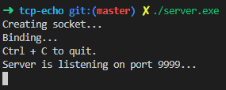

서버 프로그램인 server.exe를 실행하면 `socket() - bind()` 성공 후 `listen()`을 실행하고 대기중인 모습을 볼 수 있다.

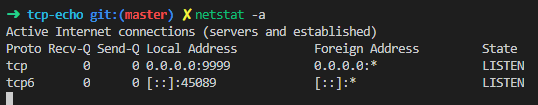

이는 linux에서 `netstat -an` 명령어를 입력했을 때 `포트 9999`에서 `LISTEN 상태`인 것을 확인할 수 있다.

#### 2. Client의 Connection setup 요청

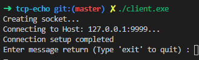

`socket() - connect()` 를 거쳐 `connection setup`이 완료된 상태를 확인할 수 있다.

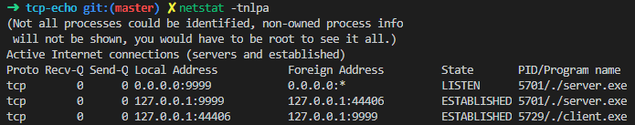

`netstat -tnlap`으로 확인했을 때 서버가 클라이언트의 연결을 수락하여 `ESTBLISHED` 상태임을 확인할 수 있다.

#### 3. 데이터 송수신

> 참고: recv() - send() 대신 read() - write() 를 사용했다. 후자의 경우 `flag` 인자가 필요하다. 기능의 차이가 없으나 통신에서 특정 기능을 위해 flag setting이 필요하다면 recv()와 send()를 사용한다.

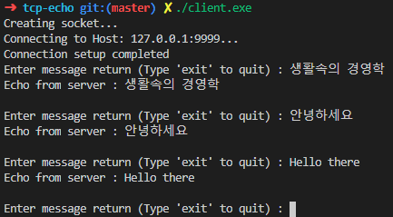

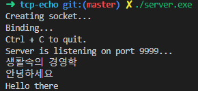

클라이언트에서 입력한 메시지를 서버에서 받아 이를 다시 돌려준다. 

#### 4. 연결 종료

- 클라이언트의 종료

`exit`를 입력했을 때 종료했을 경우이다.

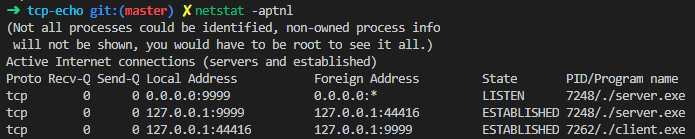

**exit 전**

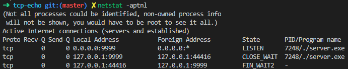

**exit 후**: 서버는 `CLOSE_WAIT`, 클라이언트는 `FIN_WAIT2` 상태가 됐다. 

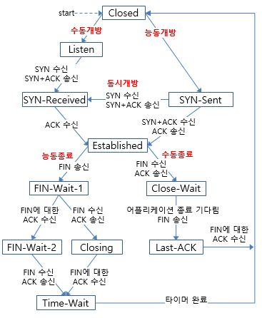

[참고: 정보통신기술용어해설](http://www.ktword.co.kr/abbr_view.php?m_temp1=657)

이는 TCP의 생명주기를 확인했을 때, 클라이언트의 `FIN` 송신 및 `FIN-ACK`의 수신으로 `FIN-WAIT2` 상태가 되었고, 서버는 `FIN`을 받아 `CLOSE-WAIT`임을 알 수 있다.

여기서 서버는 CLOSE-WAIT를 유지한다. 코드 작성 시 커넥션이 끊기면 다른 클라이언트의 연결을 허용하도록 LISTEN하도록 만들었다. 시간이 지난 후 다시 네트워크 상태를 확인했을 때, 다음과 같은 결과를 얻을 수 있었다.

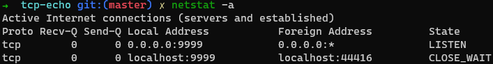

코드를 수정하여 연결이 종료되면 바로 서버 소켓도 함께 닫히게한다면 다음과 같은 결과를 얻는다.

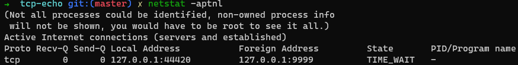

`TIME_WAIT`는 2 * `MSL(Maximum Segment Lifetime)` 으로 `60초`로 고정되어있다. 그러므로 프로그램 종료 후 같은 포트를 사용할 수 없다. 만약 이를 시도하면 listen 에러가 발생한다.

- 서버의 종료

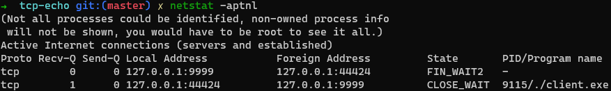

서버가 키보드 인터럽트로 인해 종료되면 클라이언트는 `CLOSE_WAIT`, 서버는 `FIN_WAIT2`로 상태가 바뀐다. 이후 `TIME_WAIT` 후 완전히 종료한다. 

이 때 클라이언트의 소켓은 닫히지 않았으므로 시간이 지나면 `netstat`에는 클라이언트만 남게된다.

## UDP와의 차이점

UDP는 클라이언트-서버 간 커넥션 셋업이 없다. 즉, 서버의 실행순서는

```
socket() - bind() - recv() || send() - close() 
```

이므로 `listen()`이나 `accept()`를 실행하지 않는다. 

주고받는 함수의 이름도 `recvfrom()`, `sendto()`로 연결되어있지 않은 상대에게 임의로 데이터를 보낸다라는 느낌이 `recv()`와 `send()`보다 강하다. 실제로 `recvfrom()`과 `sendto()`의 **인자로 상대방의 주소가 들어간다.**

클라이언트의 실행 순서는 다음과 같다.

```
socket() - sendto() || recvfrom() - close()
```

연결 작업이 없으므로 주소로 보내기만 한다. 극단적인 예로, 서버가 동작중이지 않을 때도 메시지를 보낼 수 있다. 하지만 그 메시지가 어디로 가는지 아무도 모른다. UDP의 신뢰성을 보여주는 예시이다.

마지막으로 TCP와 UDP의 차이점을 다음으로 정리할 수 있다.

- `TCP`: 클라이언트-서버 간 **사전 연결 작업**을 거친 후 데이터를 전송한다. 그러기에 데이터 교환에 있어 `안정적`이다.
- `UDP`: 클라이언트-서버 간 사전 연결 작업이 없고 헤더 크기가 상대적으로 작아 **데이터의 효용성이 좋고 빠르지만** 상대적으로 `불안정적`이다.

